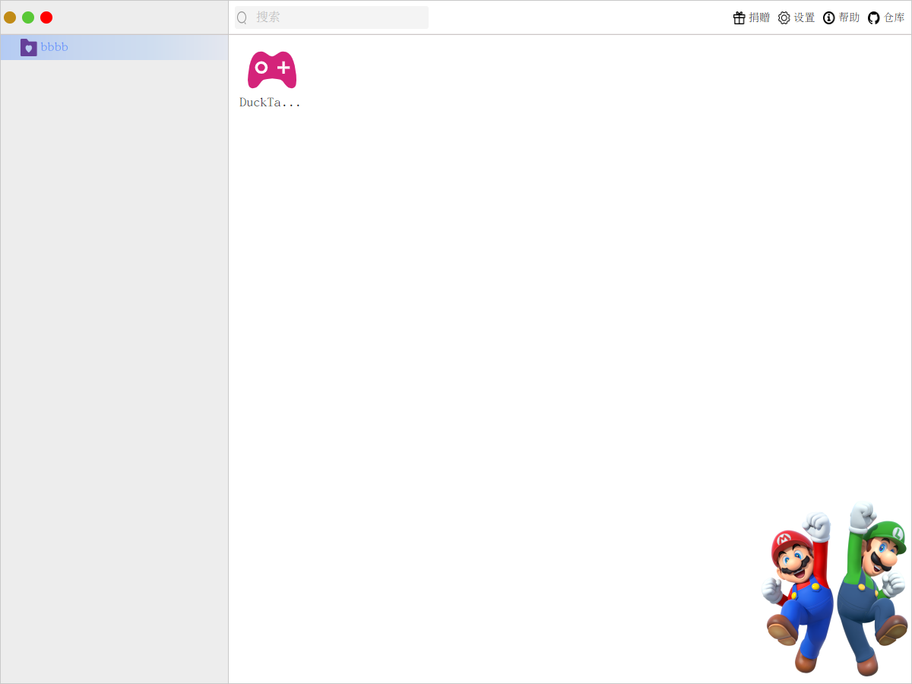
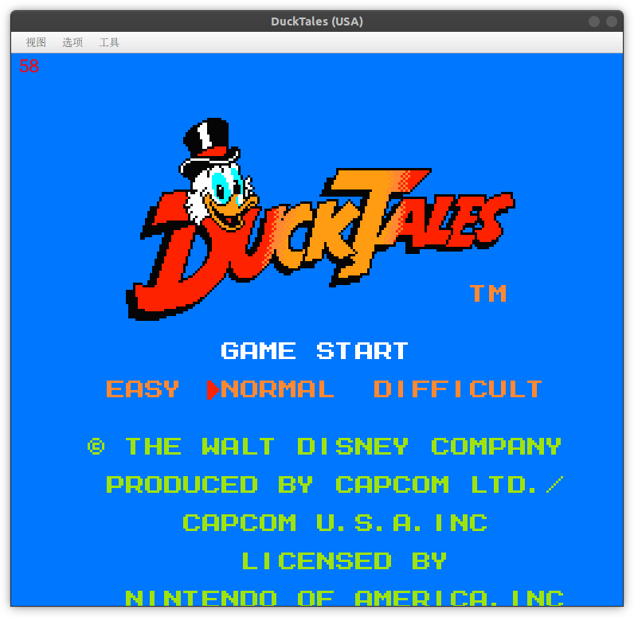

<div align="center">
  
  <h1>Nes4j</h1>
  <p>Nintendo red and white simulator</p>
</div>

<div align="center">
  <h3>
  <a href="https://gitee.com/navigatorCode/nes4j/blob/master/README.md">中文文档</a>
  </h3>
  <h3>
  <a href="https://github.com/GZYangKui/nes4j">github repository</a>
  </h3>
  
  
  
<br/>
</div>





## Project introduction

**nes4j**The Nintendo Red and White Machine Simulator is implemented in Java language, mainly
including [CPU](https://www.nesdev.org/wiki/CPU)、
[PPU](https://www.nesdev.org/wiki/PPU_programmer_reference) and [APU](https://www.nesdev.org/wiki/APU) Three parts.PPU
is a red and white machine
It is difficult to understand the most difficult module.

## Project Structure

```
nes4j
├── app UI module(javafx)
├── bin Simulator core module (CPU/PPU/APU)
└── document Development Documentation
```

## Quick start

### Download project

``` shell
git clone https://gitee.com/navigatorCode/nes4j.git
```

### Start project

```shell
 mvn run
```

## Support cartridge mapper

+ [NROM](https://www.nesdev.org/wiki/NROM)
+ [UxROM](https://www.nesdev.org/wiki/UxROM)
+ [CNROM](https://www.nesdev.org/wiki/INES_Mapper_003)

> More cartridge mapper are being implemented, please wait.

## The core module is introduced separately

> If you feel that the current game output program cannot meet your needs, you can provide PR to us, and we will try
> our best to meet your needs. Another way is to introduce nes4j bin module yourself to achieve video and audio output
> of
> the game.

### First introduce dependency

+ Apache Maven

```xml

<dependency>
    <groupId>cn.navclub</groupId>
    <artifactId>nes4j-bin</artifactId>
    <version>1.0.1</version>
</dependency>
```

+ Gradle(groovy)

```groovy
implementation group: 'cn.navclub', name: 'nes4j-bin', version: '1.0.1'
```

or

```groovy
implementation 'cn.navclub:nes4j-bin:1.0.1'
```

+ Gradle(Kotlin)

```kotlin
implementation("cn.navclub:nes4j-bin:1.0.1")
```

### Then create an NES instance and initialize

+ GameWorld.java

```java

import cn.navclub.nes4j.bin.NES;
import cn.navclub.nes4j.bin.io.JoyPad;
import cn.navclub.nes4j.bin.ppu.Frame;

public class GameWorld {
    public NES create() {
        NES instance = NES.NESBuilder
                .newBuilder()
                //nes game rom
                .file(file)
                //Audio Handler 
                .player(JavaXAudio.class)
                //Game loop callback
                .gameLoopCallback(GameWorld.this::gameLoopCallback)
                .build();
        try {
            //Current method was called current will block current thread until game stop or exception occurred
            instance.execute();
        } catch (Exception e) {
            //todo An error occurred during the game.Once error occurred game immediate stop 
        }
    }

    //This function was callback when a game frame generate
    private void gameLoopCallback(Frame frame, JoyPad joyPad, JoyPad joyPad1) {

    }
}

```

+ JavaXAudio.java

```java
package cn.navclub.nes4j.app.audio;

import cn.navclub.nes4j.bin.apu.Player;

import javax.sound.sampled.*;

import static cn.navclub.nes4j.bin.util.BinUtil.int8;

@SuppressWarnings("all")
public class JavaXAudio implements Player {
    private final byte[] sample;
    private final Line.Info info;
    private final AudioFormat format;
    private final SourceDataLine line;

    private int index;


    public JavaXAudio() throws LineUnavailableException {
        this.sample = new byte[735 * 2];
        this.format = new AudioFormat(44100, 8, 1, false, false);
        this.info = new DataLine.Info(SourceDataLine.class, format);
        this.line = (SourceDataLine) AudioSystem.getLine(info);

        line.open(format);
        line.start();
    }

    //When a audio sample generate call this function
    @Override
    public void output(float sample) {
        var value = int8(Math.round(sample * 0xff));
        this.sample[this.index++] = value;
        if (this.index == this.sample.length) {
            this.index = 0;
            this.line.write(this.sample, 0, this.sample.length);
        }
    }

    //When Nes instance stop or error occurred call this function
    @Override
    public void stop() {
        this.line.close();
    }
}
```

## Participatory contributions

We strongly welcome interested developers to participate in the project construction, and welcome everyone to put
forward valuable suggestions and functional requirements for the project. The project is being actively developed, and
welcome PR 👏。

## Copyright Description

At present, most of the game copyrights in the market are owned by [Nintendo]((https://www.nintendo.com/)).
Do not distribute the game without permission from Nintendo If any infringement is caused thereby, it has nothing
to do with the software. If any infringing material is designed in the software, please send an email to
GZYangKui@126.com Notify me to delete the corresponding infringing materials.

## Development Documentation

If you want to write your own simulator or understand the internal structure of the simulator, the following resources
can provide you with some basic knowledge of the simulator:

* [NES Documentation (PDF)](http://nesdev.com/NESDoc.pdf)
* [NES Reference Guide (Wiki)](http://wiki.nesdev.com/w/index.php/NES_reference_guide)
* [6502 CPU Reference](http://www.obelisk.me.uk/6502/reference.html)

## Special thanks

| name                                    | describe                                                     |
|-----------------------------------------|--------------------------------------------------------------|
| [Jetbrain](https://www.jetbrains.com/)  | Provide a complete set of integrated development environment |
| [NES forum](https://forums.nesdev.org/) | Provide technical support                                    |
