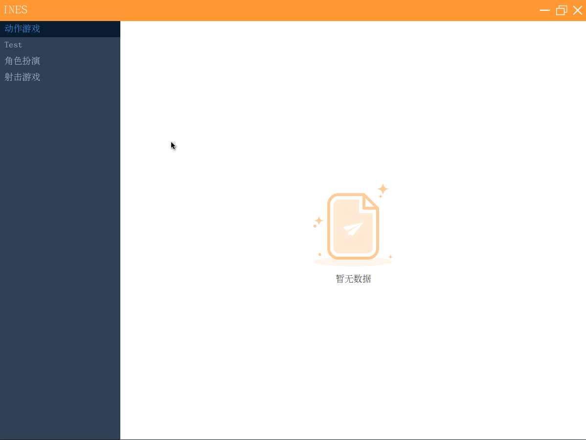
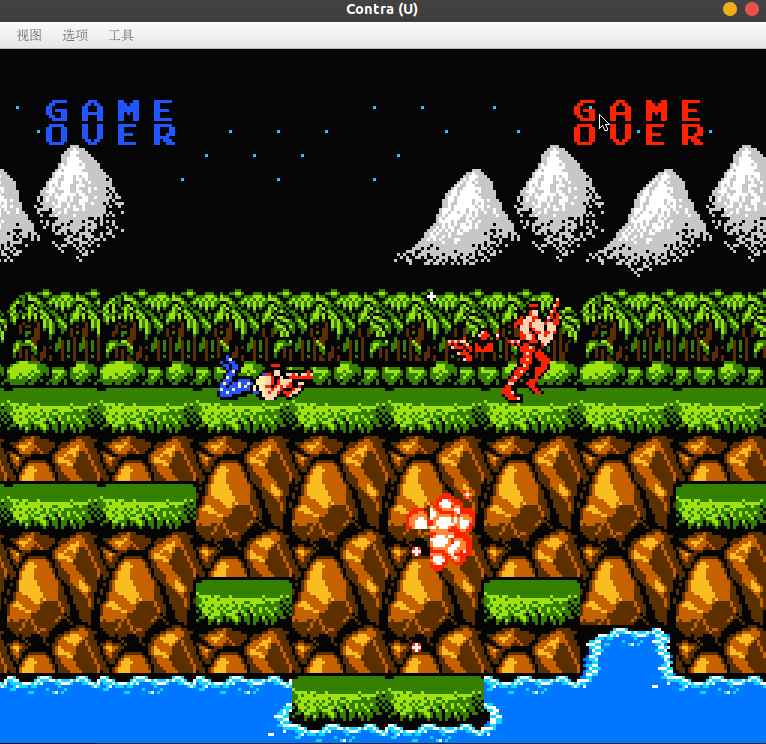

# nes4j


<br/>

## Project introduction

**nes4j**The Nintendo Red and White Machine Simulator is implemented in Java language, mainly
including [CPU](https://www.nesdev.org/wiki/CPU)、
[PPU](https://www.nesdev.org/wiki/PPU_programmer_reference) and [APU](https://www.nesdev.org/wiki/APU) Three parts.PPU
is a red and white machine
It is difficult to understand the most difficult module.

## Project Structure

```
nes4j
├── app UI module(javafx)
├── bin Simulator core module (CPU/PPU/APU)
└── document Development Documentation
```

## Quick start

### Download project

``` shell
git clone https://gitee.com/navigatorCode/nes4j.git
```

### Start project

```shell
 mvn run
```

Or click directly [Launcher](app/src/main/java/cn/navclub/nes4j/app/Launcher.java) run

##       

### Application screenshot



### Game interface



## Support cartridge mapper

+ [NROM](https://www.nesdev.org/wiki/NROM)
+ [UxROM](https://www.nesdev.org/wiki/UxROM)
+ [CNROM](https://www.nesdev.org/wiki/INES_Mapper_003)

> More cartridge mapper are being implemented, please wait.

## Participatory contributions

We strongly welcome interested developers to participate in the project construction, and welcome everyone to put
forward valuable suggestions and functional requirements for the project. The project is being actively developed, and
welcome PR 👏。

## Copyright Description

At present, most of the game copyrights in the market are owned by [Nintendo]((https://www.nintendo.com/)).
Do not distribute the game without permission from Nintendo If any infringement is caused thereby, it has nothing
to do with the software. If any infringing material is designed in the software, please send an email to
GZYangKui@126.com Notify me to delete the corresponding infringing materials.

## Development Documentation

If you want to write your own simulator or understand the internal structure of the simulator, the following resources
can provide you with some basic knowledge of the simulator:

* [NES Documentation (PDF)](http://nesdev.com/NESDoc.pdf)
* [NES Reference Guide (Wiki)](http://wiki.nesdev.com/w/index.php/NES_reference_guide)
* [6502 CPU Reference](http://www.obelisk.me.uk/6502/reference.html)