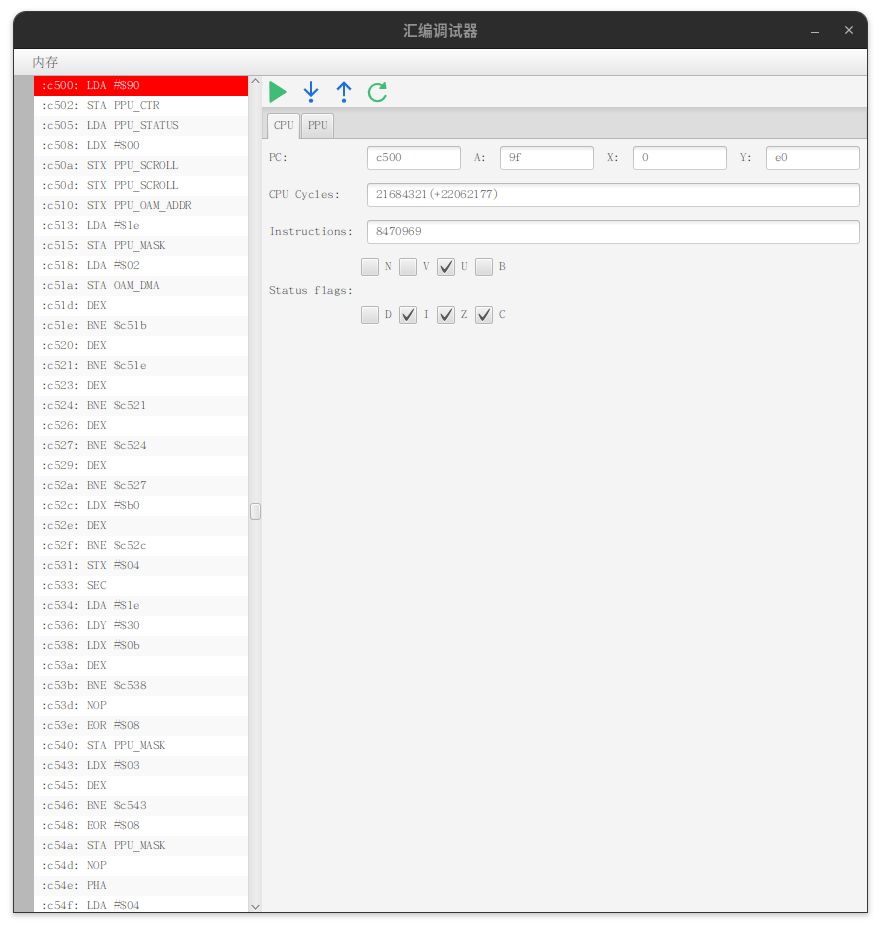
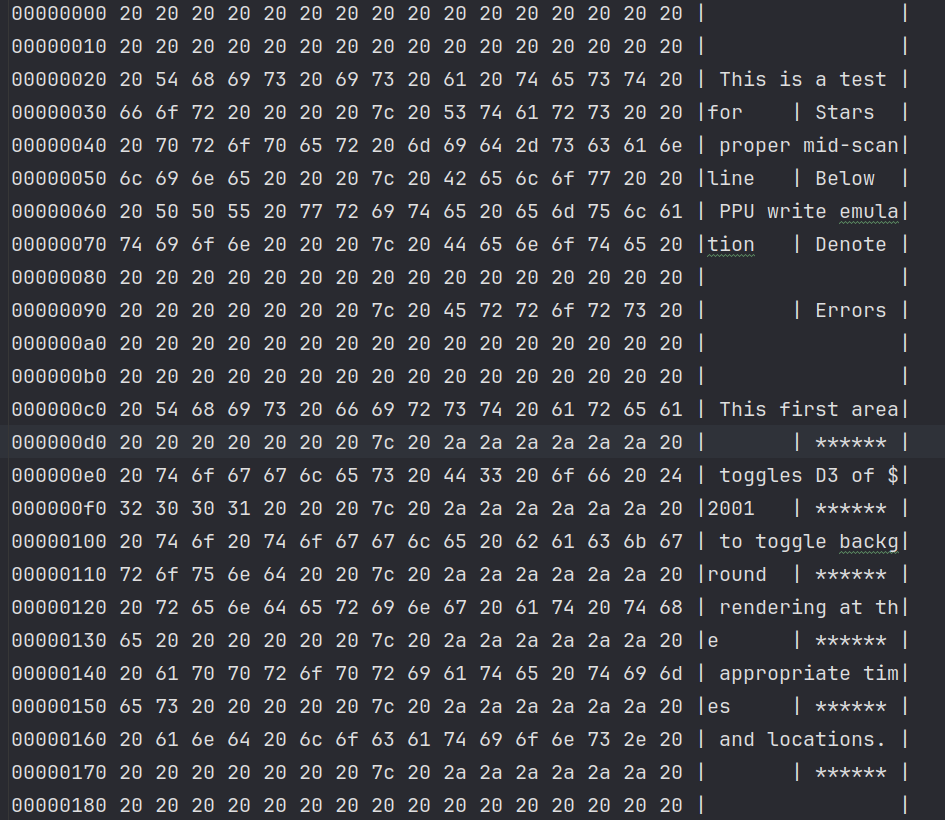

<div align="center">
  
  <h1>Nes4j</h1>
  <p>任天堂红白机模拟器</p>
</div>

<div align="center">
  <h3>
  <a href="README.md">English Document</a>
  </h3>
  <h3>
  <a href="https://github.com/GZYangKui/nes4j">github仓库</a>
  </h3>
  
  
  
  
  
<br/>
</div>


## 项目介绍

**nes4j**是使用java语言实现任天堂红白机模拟器,主要包括[CPU](https://www.nesdev.org/wiki/CPU)、
[PPU](https://www.nesdev.org/wiki/PPU_programmer_reference)和[APU](https://www.nesdev.org/wiki/APU)三部分组成.其中PPU是红白机
实现难度最大的一个模块,理解起来有点困难.

## 项目结构

```
nes4j
├── app UI模块(javafx)
├── bin 模拟器核心模块(CPU/PPU/APU)
└── document 开发文档
```

## 快速启动

### 下载项目

``` shell
git clone https://gitee.com/navigatorCode/nes4j.git
```

### 启动项目

```shell
 mvn run
```

## 已实现卡带Mapper

+ [NROM](https://www.nesdev.org/wiki/NROM)
+ [MMC1](https://www.nesdev.org/wiki/MMC1)
+ [UxROM](https://www.nesdev.org/wiki/UxROM)
+ [CNROM](https://www.nesdev.org/wiki/INES_Mapper_003)
+ [KonamiVRC24](https://www.nesdev.org/wiki/VRC2_and_VRC4)

> 更多卡带Mapper正在实现中,敬请期待。

## 自定义音视频输出

> 如果你觉得当前游戏输出程序无法满足你的需求,你可以给我们提PR,我们会尽可能满足你的需求,另外一种方法就是你自己引入nes4j-bin模块自己实现
> 游戏视屏和音频输出

### 首先引入依赖

+ Apache Maven

```xml

<dependency>
    <groupId>cn.navclub</groupId>
    <artifactId>nes4j-bin</artifactId>
    <version>1.0.5</version>
</dependency>
```

+ Gradle(groovy)

```groovy
implementation group: 'cn.navclub', name: 'nes4j-bin', version: '1.0.6'
```

or

```groovy
implementation 'cn.navclub:nes4j-bin:1.0.6'
```

+ Gradle(Kotlin)

```kotlin
implementation("cn.navclub:nes4j-bin:1.0.6")
```

### 创建NES实例并初始化

+ GameWorld.java

```java

import cn.navclub.nes4j.bin.NesConsole;
import cn.navclub.nes4j.bin.io.JoyPad;
import cn.navclub.nes4j.bin.ppu.Frame;

public class GameWorld {
    public NES create() {
        NesConsole console = NesConsole.Builder
            .newBuilder()
            //nes游戏rom
            .file(file)
            //音频输出程序
            .player(JavaXAudio.class)
            //Game loop 回调
            .gameLoopCallback(GameWorld.this::gameLoopCallback)
            .build();
        try {
            //一旦当前方法被调用将会阻塞当前线程直到游戏结束或者异常发生
            console.execute();
        } catch (Exception e) {
            //todo 当异常发生当前游戏立即停止
        }
    }

    //当PPU输出一帧视屏时回调该函数
    private void gameLoopCallback(Frame frame, JoyPad joyPad, JoyPad joyPad1) {

    }
}

```

+ JavaXAudio.java

```java

@SuppressWarnings("all")
public class JavaXAudio implements Player {
    private final byte[] sample;
    private final byte[] buffer;
    private final Line.Info info;
    private final AudioFormat format;
    private final SourceDataLine line;
    private int ldx;
    //Current fill index
    private int index;
    private final Thread thread;
    private volatile boolean stop;
    private final static int SAMPLE_SIZE = 55;

    private static final LoggerDelegate log = LoggerFactory.logger(JavaXAudio.class);


    public JavaXAudio(Integer sampleRate) throws LineUnavailableException {
        this.sample = new byte[SAMPLE_SIZE];
        this.buffer = new byte[SAMPLE_SIZE];
        this.thread = new Thread(this::exec);
        this.format = new AudioFormat(sampleRate, 8, 1, false, false);
        this.info = new DataLine.Info(SourceDataLine.class, format);
        this.line = (SourceDataLine) AudioSystem.getLine(info);

        line.open(format);
        line.start();

        this.thread.start();
    }

    @Override
    public void output(byte sample) {
        this.buffer[this.index] = sample;
        this.index++;
        if (this.index == SAMPLE_SIZE) {
            this.index = 0;
            System.arraycopy(this.buffer, 0, this.sample, 0, SAMPLE_SIZE);
            LockSupport.unpark(this.thread);
        }
        this.index %= SAMPLE_SIZE;
    }


    private void exec() {
        while (!this.stop) {
            LockSupport.park();
            this.line.write(this.sample, 0, SAMPLE_SIZE);
        }
    }

    @Override
    public void stop() {
        this.stop = true;
        LockSupport.unpark(this.thread);
        this.line.close();
    }

    @Override
    public void reset() {
        this.index = 0;
    }
}
```

## 参与贡献

我们强烈欢迎有兴趣的开发者参与到项目建设中来，同时欢迎大家对项目提出宝贵意见建议和功能需求，项目正在积极开发，欢迎 PR 👏。

## 版权说明

目前市场上绝大部分游戏版权为[任天堂](https://www.nintendo.com/)所有,请勿在未取得任天堂授权的情况下私自分发游戏.
如果因此引发的任何侵权行为均与本软件无关.如果本软件中设计任何侵权素材请发送邮件到cnnes4j@126.com通知我删除对应侵权素材.

## 文档

如果你也想编写自己的模拟器或想了解模拟器内部结构,以下资源可以给你提供一些模拟器基础知识:

* [NES Documentation (PDF)](http://nesdev.com/NESDoc.pdf)
* [NES Reference Guide (Wiki)](http://wiki.nesdev.com/w/index.php/NES_reference_guide)
* [6502 CPU Reference](http://www.obelisk.me.uk/6502/reference.html)

### 汇编调试(实验功能)

> 主界面 -> 工具 -> 调试



> 程序内存快照 (内存)
>


## 自定义指令

> 为了方便程序调试开发，模拟器内部会不断新增自定义指令。

+ LOG($FF)日志输出指令

```assembly
LOG        =        $FF
NULL       =        0

.segment            "STARTUP"

start:
.byte LOG,"ra=\{c.a},rx={c.x},ry={c.y}",NULL
sei
clc
lda #$80
sta PPU_CTRL                    ;Enable val flag
jmp waitvbl
...
```

> 字符串支持类字符串模板功能，仅支持内置变量例如上述代码中的c.a、c.x、c.y等等

| 变量                                      | 描述      |
|------------------------------------------|---------|
|       c.a                                | CPU累计寄存器 |
|       c.x                                | CPU X寄存器 |
|       c.y                                | CPU Y寄存器 |
|       c.sp                               | CPU  栈指针   |

> 后期考虑新增PPU和APU、模拟器相关寄存器变量。


## 技术交流学习


## 特别感谢

| 名称                                      | 描述           |
|-----------------------------------------|--------------|
| [Jetbrain](https://www.jetbrains.com/)  | 免费提供全套集成开发环境 |
| [NES forum](https://forums.nesdev.org/) | 提供技术支持       |
